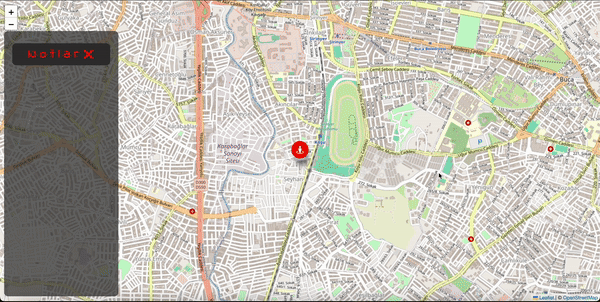

# NoteMap

<h1>NoteMap</h1>

Note Map Application: Real-time Location and Notes

This web application allows users to access their real-time location and manage various notes on the map. The application is developed using JavaScript, HTML, and CSS, and the Leaflet map library is utilized to dynamically retrieve map data.

<h1>Key Features:</h1>

Real-time Location Tracking:

Upon accessing the web application, JavaScript is used to retrieve real-time location information.
The user's location is marked on the map with a pointer.
Adding and Displaying Notes:

Clicking on an area on the map adds a note.
The note window contains data such as the name, date, and status of the entered location.
Notes are represented on the map with icons, and users can view note details by clicking on the note icons.
Routing Process:

Clicking on note icons on the map initiates a routing process to the user-defined location.
This allows users to easily navigate to previously marked locations.
Dynamic Note Window:

The note window has a dynamic structure that can be opened and closed by the user.
It provides a user-friendly interface when adding or viewing notes.

<h1>Technologies Used:</h1>

JavaScript: Used to create dynamic content, retrieve location information, and facilitate map interactions.
HTML: Used to structure the web page.
CSS: Used for designing the user interface and making visual adjustments.
Leaflet: Utilized to retrieve map data and perform map-related operations.

<h1>screenshot</h1>

